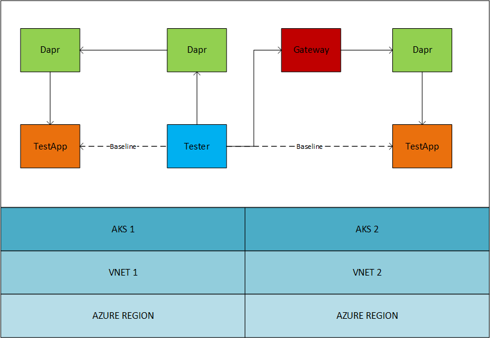

# Cross-Network Performance Tests



The performance test defined in this document are intended to show the latency added by dapr for cross network calls. We build on dapr's existing performance test suite to run 
additional tests that route traffic across different AKS clusters. In the first instance, we run cross network calls within an Azure region. We then re-run the test against a geographically separated Azure region. A baseline call is made to try to approximate the expected network latency without dapr, so that we can better judge the impact dapr is having on the overall latency.

To run the tests, please follow the steps below.

## Running the tests

- Create the test environment
```bash
# In the dapr gateway hack repo.
./perf/createTestEnv.sh
```

- Create custom certificates by following the instructions in `$REPO_ROOT/sentry-config/readme.md`

- Clone the gateway Dapr fork repo
```bash
git clone git@github.com:jjcollinge/dapr.git
git checkout jjcollinge/gateways
```

- Build and publish the Dapr fork
```bash
# In the forked dapr repo.
export DAPR_REGISTRY="docker.io/<username>"
export DAPR_TAG="<tag>"
make build-linux
make docker-build
make docker-push
```

- Create the `dapr-system` namespace in each cluster
```bash
kubectl create ns dapr-system
```

- Deploy custom Dapr to each cluster
```bash
# In the dapr gateway hack repo.
helm install \
  --set-file dapr_sentry.tls.issuer.certPEM="$PATH_TO_ISSUER_CERT.pem" \
  --set-file dapr_sentry.tls.issuer.keyPEM="$PATH_TO_ISSUER_CERT.key" \
  --set-file dapr_sentry.tls.root.certPEM="$PATH_TO_ROOT_CERT.pem" \
  --set-string global.registry=docker.io/<username> \
  --set-string global.tag=<tag> \
  --namespace dapr-system \
  dapr \
  "$PATH_TO_DAPR_FORK/charts/dapr"
```

- Deploy a gateway into each receiving cluster
```bash
# In the dapr gateway hack repo.
kubectl apply -f "./gateway"
```

- Build and publish the Dapr fork tests
```bash
# In the forked dapr repo.
make build-perf-app-tester
make build-perf-app-service_invocation_http
make push-perf-app-tester
make push-perf-app-service_invocation_http
```

- Update the registry and tag in the testapp to use your custom images
```bash
# In the dapr gateway hack repo.
vim "./perf/receiver/testapp.yaml"
```

- Deploy testapp into cluster 2 and cluster 3
```bash
# In the dapr gateway hack repo.
kubectl apply -f "./perf/receiver"
```

- Add the gateway services' external IPs to the Dapr config
```bash
# In the dapr gateway hack repo.
vim "./perf/sender/gateway-config.yaml"
```

- Deploy Dapr config cluster 1
```bash
# In the dapr gateway hack repo.
kubectl apply -f "./perf/sender/gateway-config.yaml"
```

- Update the perf test environment file
```bash
# In the dapr gateway hack repo.
vim "./perf/perf.env"
```

- Source the environment file
```bash
# In the dapr gateway hack repo.
. ". ./perf/perf.env"
```

- In cluster 1, run service invocation perf tests.
```bash
# In the forked dapr repo.
make test-perf-service_invocation_http
```

- Update the perf test environment file to enable cluster 3.
```bash
# In the dapr gateway hack repo.
vim "./perf/perf.env"
```

- Source the environment file
```bash
# In the dapr gateway hack repo.
. "$./perf/perf.env"
```

- In cluster 1, run service invocation perf tests.
```bash
# In the forked dapr repo
make test-perf-service_invocation_http
```