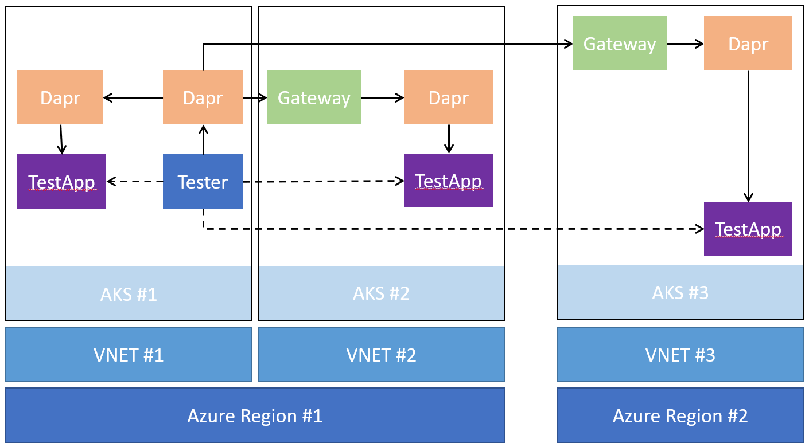

# Cross-Network Performance Tests



The performance test defined in this document are intended to show the latency added by dapr for cross network calls. We build on dapr's existing performance test suite to run 
additional tests that route traffic across different AKS clusters. In the first instance, we run cross network calls within an Azure region. We then re-run the test against a geographically separated Azure region. A baseline call is made to try to approximate the expected network latency without dapr, so that we can better judge the impact dapr is having on the overall latency.

## Running the tests

```bash
# In the dapr gateway hack repo.
./perf/run.sh
```
## Results
Initial runs yeilded the following results:
```json
{
  "testEnv": {
    "clusters": [
      {
        "location": "uksouth",
        "nodeCount": "3",
        "nodeSku": "Standard_A4_v2"
      },
      {
        "location": "uksouth",
        "nodeCount": "3",
        "nodeSku": "Standard_A4_v2"
      },
      {
        "location": "westus",
        "nodeCount": "3",
        "nodeSku": "Standard_A4_v2"
      }
    ]
  },
  "testParams": {
    "qps": "1000",
    "connections": "16",
    "duration": "1m",
    "payloadSize": "1024",
  },
  "testResults":
  [
    {
      "testName": "SameClusterSameRegion",
      "daprVersion": "v1.1.2",
      "latencyAddedByDapr": {
        "75th": "1.95ms",
        "90th": "2.31ms"
      }
    },
    {
      "testName": "SameClusterSameRegion",
      "daprVersion": "forked",
      "latencyAddedByDapr": {
        "75th": "6.41ms",
        "90th": "8.84ms"
      },
      "latencyIncreaseOverDaprBaseline": {
        "75th": "4.76ms",
        "90th": "6.53ms",
      }
    },
    {
      "testName": "DiffClusterSameRegion",
      "daprVersion": "forked",
      "latencyAddedByNetwork": {
        "75th": "0.83ms",
        "90th": "0.98ms"
      },
      "latencyAddedByDapr": {
        "75th": "5.35ms",
        "90th": "8.15ms"
      },
      "latencyIncreaseOverDaprBaseline": {
        "75th": "3.4ms",
        "90th": "5.84ms",
      }
    },
    {
      "testName": "DiffClusterDiffRegion",
      "daprVersion": "forked",
      "latencyAddedByNetwork": {
        "75th": "137.89ms",
        "90th": "138.63ms"
      },
      "latencyAddedByDapr": {
        "75th": "7.74ms",
        "90th": "8.84ms"
      },
      "latencyIncreaseOverDaprBaseline": {
        "75th": "5.79ms",
        "90th": "6.53ms",
      }
    }
  ]
}
```